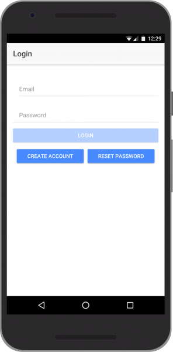

# ionic-firebase-auth
Login and Register using Ionic 3 and Firebase

### Screenshot App




### Demo App
You can check demo app on [https://ionic-firebase-auth.netlify.com/](https://ionic-firebase-auth.netlify.com/)

### Installation
Download this repo or you can clone this repo using following command
```sh
$ git clone https://github.com/andriyandriyan/ionic-firebase-auth.git
```
Move your directory to this folder app and then install dependency using following command
```sh
$ cd ionic-firebase-auth
$ npm install
```
Create your firebase project on [Firebase Console](https://console.firebase.google.com/).
Create your web app and copy firebase config to `app.module.ts`

Run your ionic app using following command
```sh
$ ionic serve
```
Your app is running on [http://localhost:8100](http://localhost:8100)